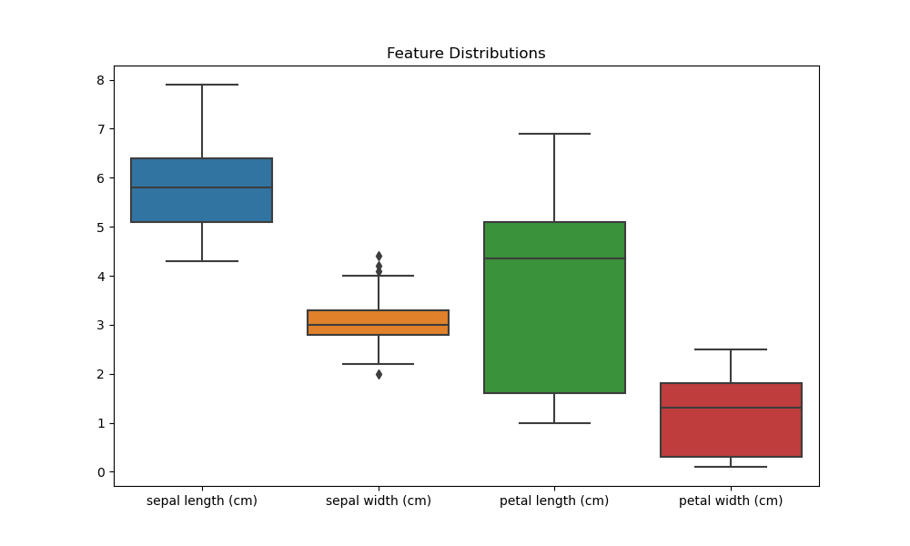
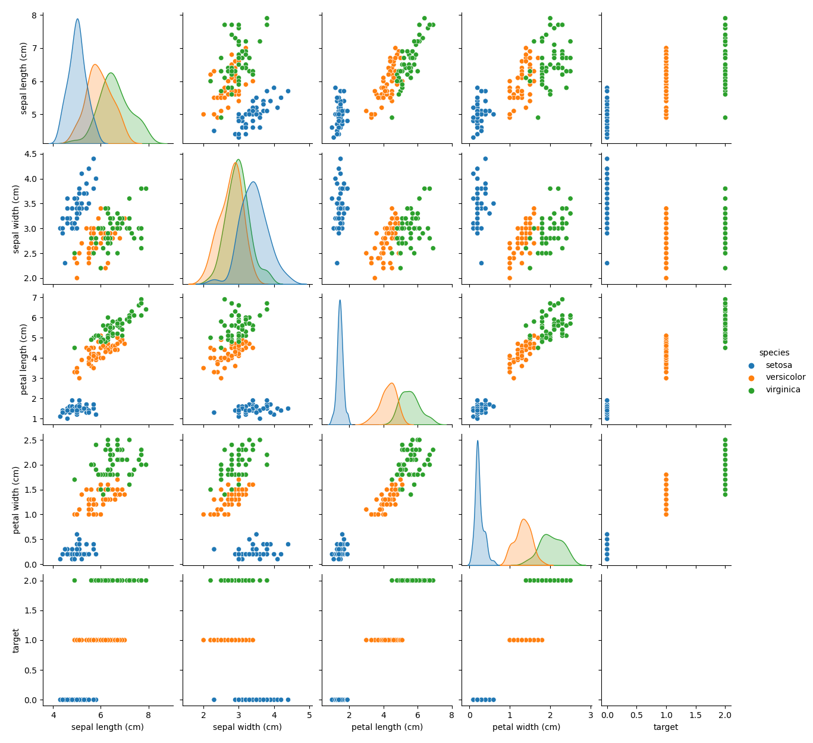
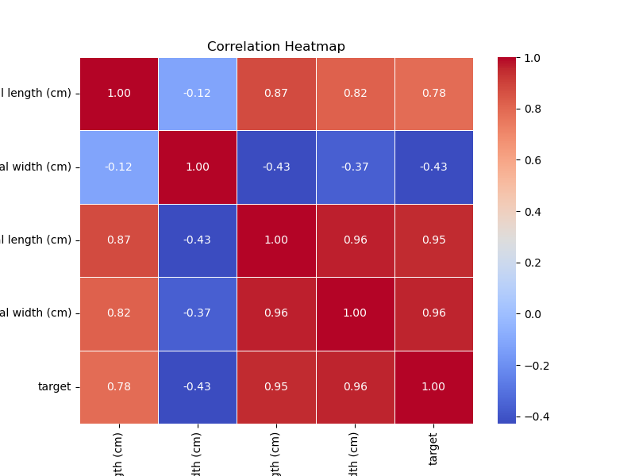
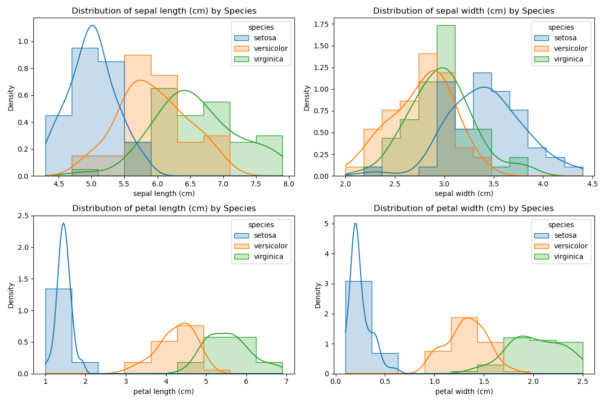
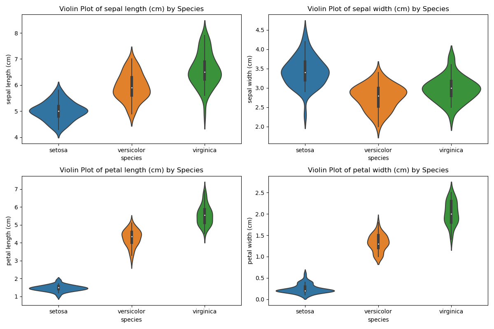
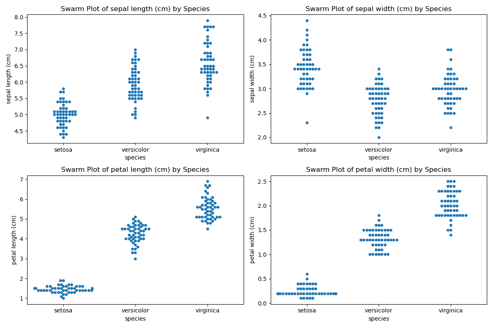

# Exploratory-Data-Analysis-EDA-on-the-Iris-Dataset
This repository contains a Jupyter Notebook for performing Exploratory Data Analysis (EDA) on the classic Iris dataset. The Iris dataset consists of measurements of iris flowers from three species: Setosa, Versicolor, and Virginica.

## Overview
The Jupyter Notebook in this repository loads the Iris dataset using scikit-learn and performs various EDA techniques to explore and visualize the data.

## Techniques Demonstrated
1. **Dataset Overview**: The notebook loads the Iris dataset and displays the first few rows and summary statistics to provide an overview of the data.
2. **Pairplot and Boxplot**: Visualizes pairwise relationships between features using a pairplot. Displays boxplots to visualize feature distributions across different species.
3. **Correlation Heatmap**: Calculates the correlation matrix between numerical features and visualizes it as a heatmap. Helps identify relationships and dependencies between features.
4. **Distribution Plots**: Displays distribution plots for each feature by species using histograms. Helps visualize the distribution of feature values and their variation across species.
5. **Violin Plots**: Uses violin plots to show the distribution of feature values by species. Provides insights into the spread and density of feature values across species.
6. **Swarm Plots**: Utilizes swarm plots to visualize the distribution of feature values by species. Helps identify individual data points and their distribution across species.

## Usage
1. Clone the repository to your local machine.
2. Install the required dependencies listed in requirements.txt using pip: `pip install -r requirements.txt`.
3. Launch Jupyter Notebook and open the `Exploratory Data Analysis of the Iris Dataset.ipynb` notebook.
4. Run each cell in the notebook to perform EDA on the Iris dataset.

## Screenshots
1. **Feature Distribution**;

2. **Pairplot and Boxplot**:

3. **Correlation Heatmap**:

4. **Distribution Plots**:

5. **Violin Plots**:

6. **Swarm Plots**:

## License
This repository is open-source and has no associated license. All rights are reserved.
